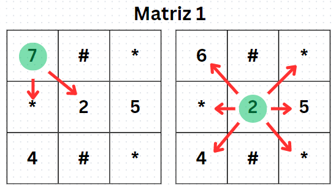

# Labirinto recursivo

	O algoritmo tem como objetivo caminhar de forma randômica por N matrizes NxN ou seja, quadráticas, na qual se encontra diversos obstaculos, como se fosse um labirinto. As matrizes são constituidas por numeros inteiros de 0 a 9, por paredes representadas pelo caracter # e por perigos representados pelo caracter *. O caminhho realizado é de forma randômica, a cada iteração a posição será alterada para alguma posição válida aleatória, ou seja uma posição ao redor da posiçaõ atual. Durante a trajetória, as poscições que contém numeros devem ser subtraidas em 1 a cada passagem, além disso ao passar por um perrigo a vida é consumida.

	Em relação as paredes, não a muito o que fazer a não ser desviar e continuar a rota. Já os perigos como foi dito, sempre consomem a vida ao se passar por eles, nesse caso é subtraido 1 de um total de 9 vidas. Assim, ao ficar sem pontos de vida o algoritmo deve parar e indicar o fim do jogo. Outra forma de acabar com o jogo é vencendo ele, para isso é necessário percorrer um caminho sem coletar nenhum item, ou seja andar apenas em posições zeradas e voltar para a posição inicial.

	Ao decorrer da trajetória, a cada passo sob uma posição que contém um numero, é coletado um item e é subtraido 1 da posição atual como ja foi dito. Ao coletar 4 itens, a vida aumenta em 1 se não estiver cheia, ou seja, se for diferente de 9. Contudo pode haver posiçãoes da matriz cujo o valor é 0, nesse caso não é coletado item e tambem não é decrementado 1 da posição.

	As matrizes são lidas de um arquivo input.data. O objetivo do trabalho é percorrer as matrizes até que todo caminho percorrido se torne 0 ou quando a vida chegar a 0. No final é mostrado quantas casas não foram visitas, a soma de itens consumidos pelo caminho, quantos itens foram pegos no total, a quantidade de vida se ela for diferente de 0 o que significa vitoria e quantos perigos foram enfrentados ao longo do trajéto.

	Ao iniciar o algoritmo, a primeira coisa a ser feita é a leitura do arquivo input.data na função 'LerMatriz()'. O algoritmo lê todas as matrizes que estão no arquivo e cria um arquivo de saída separado para cada matriz, dessa forma quando for preciso mudar de matriz o codigo lê o arquvio correspondente e carrega a matriz de novo. Para entender como é feito a mudança de matriz é preciso entender como funciona a função 'Caminho()'. Como ja foi dito, o caminho é feito de forma randômica, neste caso quando se inicia o algoritmo é gerado uma coordenada que contem um valor de linha e um valor de coluna aleatórios armazenados nas variaveis posição_linha e posição_coluna respectivamente, feito isso durante a trajetoria dependendo da posição atual são gerado numeros entre -1 e 1 para as variaveis. Esses valores gerados são incrementados a posição atual e realizando o caminho, por exemplo, se a posição atual for linha = 2 e coluna = 1, e for gerado 0 e 1 nas variaveis posição_linha e posição_coluna, a posição nova será linha = 2 e coluna = 2, ou seja ele caminhou para direita. Sabendo disso, a mudança de matriz é feita quando a posição atual for qualquer uma da última coluna da matriz e for gerado 1 na variável posição_coluna, nesse caso será incrementado +1 na coluna e mudará de matriz, já que não existe mais colunas na matriz atual. Ao chegar na última matriz, se ocorrer uma troca de matrizes, o algoritmo irá voltar para a primeira matriz e continuará rodando da mesma forma.

	A função 'Caminho()' gera esses números aleatórios de -1 a 1 na maioria dos casos, usando a função 'rand()', incluindo a posição inicial. Existem casos em que não se pode gerar números nesse intervalo, por exemplo se a posição atual for na primeira linha, não pode gerar -1 na variável posição_linha, já que não existe uma linha a cima da primeira. Isso vale para toda a borda da matriz fora a última coluna, onde é realizado a troca de matrizes. A função 'Caminho()' é responsavel tambem pela incrementação dos itens e o decremento da vida e das posiçãoes da matriz. A vida é uma variavel do tipo int que decrementa toda vez que a posição atual for um perigo e incrementa toda vez que é pego 4 itens. Os itens tambem são uma variavel que incrementa toda vez ao passar por uma posição que contem um numero diferente de 0. Além disso, foi criada outra variavel que conta os itens totais coletados, pois a primeira zera quando são pegos 4 itens. Para o decremento das posições, como a matriz é do tipo char, foi necessário converter o caracter da posição em inteiro, decrementar e depois converter esse int em char denovo para inserir na matriz. 

	Para realizar a troca de matrizes, foram usadas 2 funções distintas. Primeiro é usada a função 'Checkpoint()' que lê a matriz atual e reescreve ela com as modificações feitas durante o trajeto no arquivo correspondente à essa matriz, dessa forma quando precisar carregar essa matriz novamente não será perdida as mudanças feitas anteriormente. Depois é usada a função 'SetMat()' que apenas lê o arquivo da proxima matriz e carrega ela no codigo. Por exemplo, se a matriz atual for a 1, quando for realizar a troca de matrizes a próxima será a matriz 2, nesse caso será chamada a função 'Checkpoint()' para salvar as mudanças da matriz 1 no arquivo referetnte a ela e depois a função 'SetMat()' que irá ler a matriz 2 do arquivo e carregar ela no codigo. 

	Figura 1	

	Figura 2	

	A Figura 1 representa o trajeto feito dentro de uma matriz 3x3. A posição esverdiada é a posição atual e as setas vermelhas representam as posições validas para caminhar. Neste exemplo o caminho feito foi para a posição central como mostra na figura, decrementando a posição anterior que era 7 e passou a ser 6. Já a Figura 2 representa a troca de matrizes, percebe-se que o caminho feito foi para a direita, da posição de numero 1 que antes era 2, para a posição de numero 5. Agpra existe posições da matriz 2 validas para caminhar, e dessa forma ocorre a troca de matriz.

	figuras 3 e 4 mostrando o terminal 

	explicar o que ocorre nas figuras

	Ao final do programa é printado no terminal se houve vitoria ou derrota, mostrando a quantidade de itens pegos no total e quantidade no inventario, a quantidade de perigos enfrentados, a quantidade de casas visitadas armazenada na variavel "passos" que incrementa a cada movimento realizado no trajeto, a quantidade de casas não visitadas. Para realizar o cálculo da quantidade de casas não visitadas foi preciso criar outra matriz espelhada a matriz principal, porém no lugar dos numeros e dos perigos foi colocado 0 e 1, mantendo as paredes. Além disso tambem é feito arquivos separados para cada matriz espelhada assim como as matrizes principais. A cada pssso realizado, é colocado 1 na posição correspondente na matriz espelhada, o objetivo disso é saber em quais posições foram passadas, ou seja, onde estiver 0 na matriz espelhada significa que essa posição não foi visitada. A função 'CasasNaoVisitadas()' recebe todos os arquivos contendo as matrizes espelhadas e conta quantas posições contem 0 armazenando na variavel contCasasNaoVisitadas. Alem disso o programa junta todos os arquivos contendo o resultado das matrizes em um arquivo de saida output.txt e o coloca na pasta dataset junto com o input.data e apaga todos os outros arquivos gerados, tudo isso é feito na função 'Resultado()'.

	Por se tratar de codigo totalmente randômico, é dificil dizer ao certo qual o custo computacional do algoritmo. A cada execução seu custo muda, podemos considerar um custo quadratico se ao final da execução for visitada todas as posições válidas e um custo linear se o trájeto for em linha reta até o fim do jogo em caso de vitoria voltando à primeira posição. Contudo pode-se dizer que o algoritmo foi bem implementado e otimizado para melhor perfomace devido as estratégias utilizadas para fazer cada função.

# Compilação e Execução

O código possui um arquivo Makefile que realiza todo o procedimento de compilação e execução. Para tanto, temos as seguintes diretrizes de execução:

| Comando                |  Função                                                                                           |                     
| -----------------------| ------------------------------------------------------------------------------------------------- |
|  `make clean`          | Apaga a última compilação realizada contida na pasta build                                        |
|  `make`                | Executa a compilação do programa utilizando o gcc, e o resultado vai para a pasta build           |
|  `make run`            | Executa o programa da pasta build após a realização da compilação                                 |
